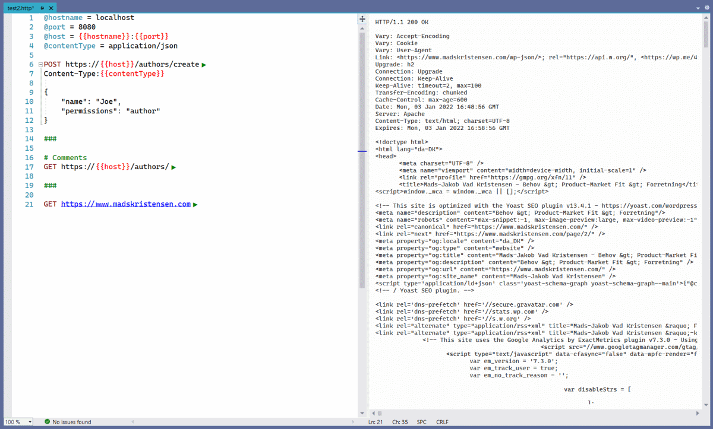

[marketplace]: https://marketplace.visualstudio.com/items?itemName=MadsKristensen.RestClient
[vsixgallery]: http://vsixgallery.com/extension/RestClientVS.a7b4a362-3ce8-4953-9b19-a35166f2cbfd
[repo]:https://github.com/madskristensen/RestClientVS/

# Rest Client for Visual Studio

**Download** this extension from the [VS Marketplace][marketplace]
or get the [CI build](https://www.vsixgallery.com/extension/RestClientVS.a7b4a362-3ce8-4953-9b19-a35166f2cbfd).

-----------------------------------

REST Client allows you to send HTTP request and view the response in Visual Studio directly. Based on the popular VS Code extension [Rest Client][vsixgallery] by [Huachao Mao](https://github.com/Huachao)



## The .http file
Any files with the extension `.http` is the entry point to creating HTTP requests.

Here's an example of how to define the requests with variables and code comments.

```css
@hostname = localhost
@port = 8080
@host = {{hostname}}:{{port}}
@contentType = application/json

POST https://{{host}}/authors/create
Content-Type:{{contentType}}

{
    "name": "Joe",
    "permissions": "author"
}

###

# Comments
GET https://{{host}}/authors/

###

GET https://www.bing.com
```

This is what it looks like in the Blue Theme.


Notice the green play buttons showing up after each URL. Clicking those will fire off the request and display the raw response on the right side of the document.


You can also right-click to find the Send Request command or use the **Ctrl+Alt+S** keyboard shortcut.


You can set the timeout of the HTTP requests from the *Options* dialog.


### How can I help?
If you enjoy using the extension, please give it a ★★★★★ rating on the [Visual Studio Marketplace][marketplace].

Should you encounter bugs or if you have feature requests, head on over to the [GitHub repo][repo] to open an issue if one doesn't already exist.

Pull requests are also very welcome, since I can't always get around to fixing all bugs myself. This is a personal passion project, so my time is limited.

Another way to help out is to [sponser me on GitHub](https://github.com/sponsors/madskristensen).
